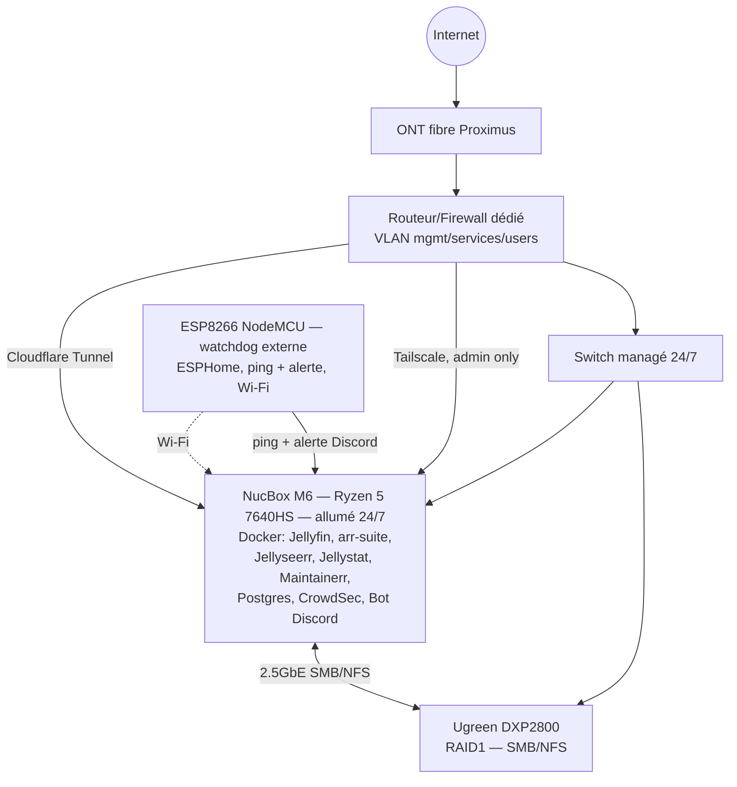

# Blackbox — homelab streaming communautaire

Jellyfin partagé avec une dizaine de personnes (famille/amis), autorégulé en
capacité et bande passante, piloté via un bot Discord. Double objectif : usage
réel pour la communauté, et vitrine technique pour mon portfolio.

- Brief complet : [docs/homelab_projet.md](docs/homelab_projet.md)
- Audit externe (risques, priorités, scoring) : [docs/audit_projet.md](docs/audit_projet.md)

Woluwe-Saint-Lambert, Bruxelles. Fibre prévue le 15 septembre 2026.
Domaine : `blackbox.homes` (Porkbun) — réservé pour le Cloudflare Tunnel (Phase 2).

## Où on en est

Phase 0 : valider les inconnues bloquantes avant de commencer à déployer quoi
que ce soit (voir §12 du brief et §17 de l'audit).

- [x] Squelette du repo
- [x] OS du NucBox tranché — Ubuntu Server LTS + HWE ([ADR-002](docs/adr/002-os-nucbox.md))
- [x] OS installé sur le NucBox
- [x] Décision extinction programmée — abandonnée, NucBox allumé 24/7, WoL abandonné ([ADR-005](docs/adr/005-nucbox-always-on.md))
- [x] Test transcodage matériel VAAPI — validé sur Radeon 760M ([ADR-006](docs/adr/006-vaapi-validated.md))
- [ ] Débit montant fibre réel — bloqué jusqu'au 15/09
- [x] RAID tranché — RAID1 ([ADR-003](docs/adr/003-raid-nas.md))
- [ ] RAID1 configuré sur le NAS
- [ ] Routeur/firewall dédié + VLAN — bloqué jusqu'à la fibre
- [ ] Stack applicative (Jellyfin déployé sur le NucBox, VAAPI passthrough
  fonctionnel ; *arr*/Jellyseerr/Postgres pas encore, stockage média encore
  local en attendant le NAS)
- [ ] Backup restic + rclone
- [ ] Bot Discord

## Architecture cible



Rien de tout ça n'est encore physiquement en place, c'est la cible.

Le NucBox reste allumé en permanence (pas d'extinction/veille programmée,
uniquement des redémarrages ponctuels nécessaires, WoL abandonné) — voir
[ADR-005](docs/adr/005-nucbox-always-on.md). Le bot Discord tourne dessus.
Pas de RPi dans l'archi cible : le seul rôle externe restant (watchdog) est
couvert par un microcontrôleur ESP8266 (AZ-Delivery NodeMCU, déjà en stock)
en Wi-Fi.

## Structure du repo

```
blackbox/
├── docs/
│   ├── homelab_projet.md   # brief, source de vérité vision/archi
│   ├── audit_projet.md     # audit externe
│   ├── adr/                # décisions d'architecture
│   └── runbooks/           # procédures opérationnelles
├── infra/
│   ├── ansible/             # provisioning NucBox
│   └── docker/
│       ├── prod/
│       ├── staging/
│       └── dev/
└── bot/                      # bot Discord Python
```

## ADR

| # | Titre |
|---|---|
| [001](docs/adr/001-monorepo-structure.md) | Structure monorepo |
| [002](docs/adr/002-os-nucbox.md) | OS du NucBox M6 — Ubuntu Server LTS + HWE |
| [003](docs/adr/003-raid-nas.md) | RAID1 sur le NAS |
| [004](docs/adr/004-wol-s3-not-s5.md) | Réveil réseau : veille S3 plutôt qu'extinction S5 (superseded) |
| [005](docs/adr/005-nucbox-always-on.md) | NucBox allumé en permanence, watchdog externe par microcontrôleur |
| [006](docs/adr/006-vaapi-validated.md) | Transcodage matériel VAAPI validé sur le NucBox M6 |

## Runbooks

| Runbook | Description |
|---|---|
| [install-os-nucbox.md](docs/runbooks/install-os-nucbox.md) | Install/réinstall Ubuntu Server LTS sur le NucBox |
| [setup-jellyfin.md](docs/runbooks/setup-jellyfin.md) | Config Jellyfin post-install : VAAPI, plugins/repos, réglages |

Le runbook WoL est archivé (obsolète, [ADR-005](docs/adr/005-nucbox-always-on.md)) : [setup-wol-nucbox.md](docs/runbooks/setup-wol-nucbox.md).

## Points ouverts

- Rétention Maintainerr (durée avant suppression auto)
- Politique d'approbation Jellyseerr par type de contenu
- Durée par défaut des comptes invités
- Choix du routeur/firewall dédié (voir audit §15)
- Modèle d'UPS (compatibilité NUT à vérifier)
- Choix d'une prise connectée pour un power-cycle physique du NucBox à
  distance (voir [ADR-005](docs/adr/005-nucbox-always-on.md))
