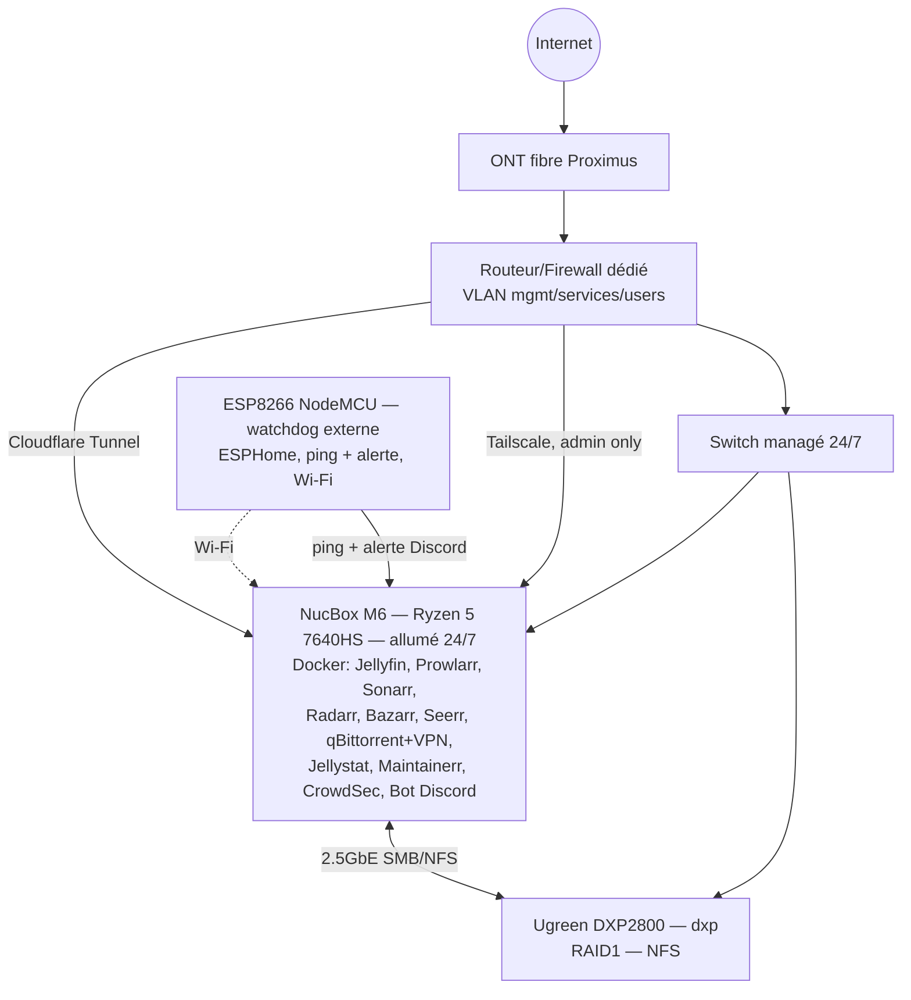

# Blackbox — homelab streaming communautaire

Jellyfin partagé avec une dizaine de personnes (famille/amis), autorégulé en
capacité et bande passante, piloté via un bot Discord. Double objectif : usage
réel pour la communauté, et vitrine technique pour mon portfolio.

- Brief complet : [docs/homelab_projet.md](docs/homelab_projet.md)
- Audit externe (risques, priorités, scoring) : [docs/audit_projet.md](docs/audit_projet.md)

Woluwe-Saint-Lambert, Bruxelles. Fibre prévue le 15 septembre 2026.
Domaine : `blackbox.homes` (Porkbun) — réservé pour le Cloudflare Tunnel (Phase 2).

## Où on en est

Phase 0 : valider les inconnues bloquantes avant de commencer à déployer quoi
que ce soit (voir §12 du brief et §17 de l'audit).

- [x] Squelette du repo
- [x] OS du NucBox tranché — Ubuntu Server LTS + HWE ([ADR-002](docs/adr/002-os-nucbox.md))
- [x] OS installé sur le NucBox
- [x] Décision extinction programmée — abandonnée, NucBox allumé 24/7, WoL abandonné ([ADR-005](docs/adr/005-nucbox-always-on.md))
- [x] Test transcodage matériel VAAPI — validé sur Radeon 760M ([ADR-006](docs/adr/006-vaapi-validated.md))
- [ ] Débit montant fibre réel — bloqué jusqu'au 15/09
- [x] RAID tranché — RAID1 ([ADR-003](docs/adr/003-raid-nas.md))
- [x] RAID1 configuré sur le NAS — NAS branché (`dxp`), RAID1 sain,
  partage NFS `media` monté sur le NucBox et utilisé par Jellyfin
- [ ] Routeur/firewall dédié + VLAN — bloqué jusqu'à la fibre
- [x] Stack applicative — Jellyfin + suite *arr* déployés sur le NucBox
  (Prowlarr, Sonarr, Radarr, Bazarr, Seerr, qBittorrent derrière un VPN
  Mullvad/Gluetun), voir [ADR-007](docs/adr/007-arr-stack.md). Postgres pas
  encore nécessaire (pas de service qui le requiert pour l'instant)
- [x] Serveur Discord communautaire — structure native (rôles, Rules
  Screening, Welcome Screen, accueil, intégration Seerr/Jellyfin), voir
  [ADR-008](docs/adr/008-discord-community.md). Le bot Discord lui-même
  reste à construire
- [x] Backup restic + rclone — configs applicatives (pas la médiathèque),
  deux dépôts indépendants : NAS local + Google Drive, quotidien via
  systemd timer, voir [ADR-011](docs/adr/011-backup-restic-rclone.md).
  Restauration à blanc pas encore testée en conditions réelles
- [ ] Bot Discord — notifications passives (Layer 1) en place sans code de
  bot : contenu ajouté (Jellyfin → webhook Discord natif) et santé VPN
  (Gluetun → script + timer systemd), voir [ADR-009](docs/adr/009-notifications-layer1.md).
  Layer 2 (`/status`, `/streams`, lecture seule) déployé et vérifié, voir
  [ADR-010](docs/adr/010-bot-layer2.md). Layer 3 (création de compte,
  gamification) pas commencé

## Architecture cible



Rien de tout ça n'est encore physiquement en place, c'est la cible.

Le NucBox reste allumé en permanence (pas d'extinction/veille programmée,
uniquement des redémarrages ponctuels nécessaires, WoL abandonné) — voir
[ADR-005](docs/adr/005-nucbox-always-on.md). Le bot Discord tourne dessus.
Pas de RPi dans l'archi cible : le seul rôle externe restant (watchdog) est
couvert par un microcontrôleur ESP8266 (AZ-Delivery NodeMCU, déjà en stock)
en Wi-Fi.

## Structure du repo

```
blackbox/
├── docs/
│   ├── homelab_projet.md   # brief, source de vérité vision/archi
│   ├── audit_projet.md     # audit externe
│   ├── adr/                # décisions d'architecture
│   └── runbooks/           # procédures opérationnelles
├── infra/
│   ├── ansible/             # provisioning NucBox
│   └── docker/
│       ├── prod/
│       ├── staging/
│       └── dev/
└── bot/                      # bot Discord Python
```

## ADR

| # | Titre |
|---|---|
| [001](docs/adr/001-monorepo-structure.md) | Structure monorepo |
| [002](docs/adr/002-os-nucbox.md) | OS du NucBox M6 — Ubuntu Server LTS + HWE |
| [003](docs/adr/003-raid-nas.md) | RAID1 sur le NAS |
| [004](docs/adr/004-wol-s3-not-s5.md) | Réveil réseau : veille S3 plutôt qu'extinction S5 (superseded) |
| [005](docs/adr/005-nucbox-always-on.md) | NucBox allumé en permanence, watchdog externe par microcontrôleur |
| [006](docs/adr/006-vaapi-validated.md) | Transcodage matériel VAAPI validé sur le NucBox M6 |
| [007](docs/adr/007-arr-stack.md) | Suite *arr* : Prowlarr, Sonarr, Radarr, Bazarr, Seerr, VPN Mullvad/Gluetun |
| [008](docs/adr/008-discord-community.md) | Discord communautaire : structure native, pas de bot pour l'instant |
| [009](docs/adr/009-notifications-layer1.md) | Notifications passives (Layer 1) : contenu ajouté + santé VPN, sans code de bot |
| [010](docs/adr/010-bot-layer2.md) | Bot Discord Layer 2 : commandes de statut en lecture seule (`/status`, `/streams`) |
| [011](docs/adr/011-backup-restic-rclone.md) | Backup restic : NAS local + Google Drive |

## Runbooks

| Runbook | Description |
|---|---|
| [install-os-nucbox.md](docs/runbooks/install-os-nucbox.md) | Install/réinstall Ubuntu Server LTS sur le NucBox |
| [setup-jellyfin.md](docs/runbooks/setup-jellyfin.md) | Config Jellyfin post-install : VAAPI, plugins/repos, réglages |
| [setup-nas.md](docs/runbooks/setup-nas.md) | Config NAS (`dxp`) : RAID1, nettoyage, partage NFS, montage NucBox |
| [setup-arr-stack.md](docs/runbooks/setup-arr-stack.md) | Suite *arr* : VPN, indexeurs, clés API, config par service |
| [setup-discord.md](docs/runbooks/setup-discord.md) | Serveur Discord : rôles, salons, Rules Screening, accueil, intégration Seerr |
| [setup-notifications.md](docs/runbooks/setup-notifications.md) | Notifications Layer 1 : webhook Jellyfin, script santé Gluetun |
| [setup-bot.md](docs/runbooks/setup-bot.md) | Bot Discord Layer 2 : application Discord, clé API Jellyfin, déploiement |
| [setup-backup.md](docs/runbooks/setup-backup.md) | Backup restic : rclone/Google Drive, NAS local, planification, restauration |

Le runbook WoL est archivé (obsolète, [ADR-005](docs/adr/005-nucbox-always-on.md)) : [setup-wol-nucbox.md](docs/runbooks/setup-wol-nucbox.md).

## Points ouverts

- Rétention Maintainerr (durée avant suppression auto)
- Politique d'approbation Jellyseerr par type de contenu
- Choix du routeur/firewall dédié (voir audit §15)
- Modèle d'UPS (compatibilité NUT à vérifier)
- Choix d'une prise connectée pour un power-cycle physique du NucBox à
  distance (voir [ADR-005](docs/adr/005-nucbox-always-on.md))
- IP codées en dur (NAS, NucBox, montage NFS, alias SSH) — à reconfigurer
  à l'installation du routeur dédié pour la fibre (voir [setup-nas.md](docs/runbooks/setup-nas.md#5-limite-connue--ip-en-dur))
- Pas de port forwarding côté VPN (Mullvad l'a retiré en 2023) — vitesses
  torrent en tant que seeder réduites sur du contenu peu populaire, pas
  bloquant pour l'usage prévu (voir [ADR-007](docs/adr/007-arr-stack.md))
- Indexeurs limités à YTS + The Pirate Bay (EZTV/1337x écartés, bloqués par
  Cloudflare) — à revisiter si le catalogue s'avère insuffisant
- Création de compte Jellyfin/Seerr automatisée à l'arrivée sur le Discord,
  et gamification par temps de visionnage — jugées faisables, reportées au
  bot Discord (voir [ADR-008](docs/adr/008-discord-community.md))
- Watchdog ESP8266 pas encore branché sur les notifications Discord
  (voir [ADR-009](docs/adr/009-notifications-layer1.md))
- Restauration restic (NAS local + Google Drive) jamais testée en
  conditions réelles, seule la sauvegarde l'a été (voir
  [ADR-011](docs/adr/011-backup-restic-rclone.md))
