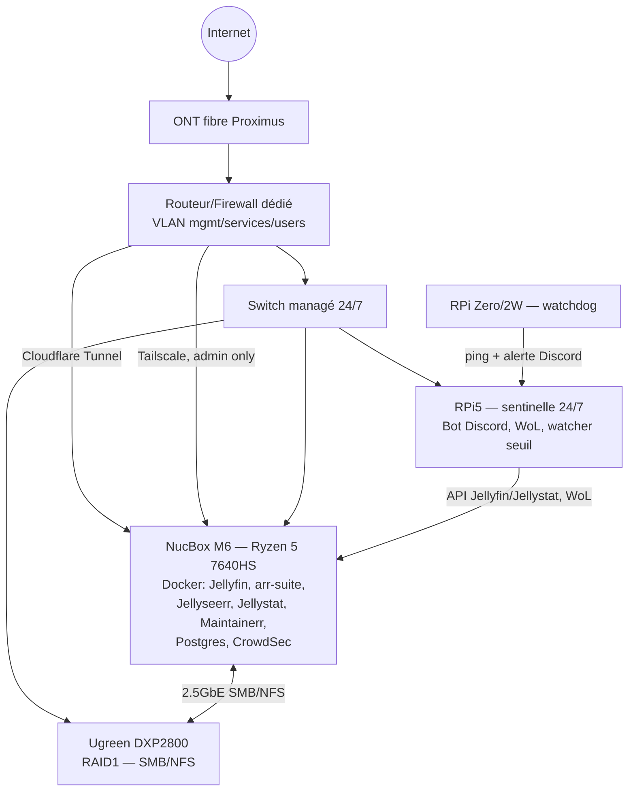

# Blackbox — homelab streaming communautaire

Jellyfin partagé avec une dizaine de personnes (famille/amis), autorégulé en
capacité et bande passante, piloté via un bot Discord. Double objectif : usage
réel pour la communauté, et vitrine technique pour mon portfolio.

- Brief complet : [docs/homelab_projet.md](docs/homelab_projet.md)
- Audit externe (risques, priorités, scoring) : [docs/audit_projet.md](docs/audit_projet.md)

Woluwe-Saint-Lambert, Bruxelles. Fibre prévue le 15 septembre 2026.

## Où on en est

Phase 0 : valider les inconnues bloquantes avant de commencer à déployer quoi
que ce soit (voir §12 du brief et §17 de l'audit).

- [x] Squelette du repo
- [x] OS du NucBox tranché — Ubuntu Server LTS + HWE ([ADR-002](docs/adr/002-os-nucbox.md))
- [ ] OS installé sur le NucBox
- [ ] Test Wake-on-LAN
- [ ] Test transcodage matériel VAAPI (Radeon 760M)
- [ ] Débit montant fibre réel — bloqué jusqu'au 15/09
- [ ] RAID tranché
- [ ] RAID1 configuré sur le NAS
- [ ] Routeur/firewall dédié + VLAN — bloqué jusqu'à la fibre
- [ ] Stack applicative (Jellyfin, *arr*, Jellyseerr...)
- [ ] Backup restic + rclone
- [ ] Bot Discord

## Architecture cible



Rien de tout ça n'est encore physiquement en place, c'est la cible.

## Structure du repo

```
blackbox/
├── docs/
│   ├── homelab_projet.md   # brief, source de vérité vision/archi
│   ├── audit_projet.md     # audit externe
│   ├── adr/                # décisions d'architecture
│   └── runbooks/           # procédures opérationnelles
├── infra/
│   ├── ansible/             # provisioning NucBox + RPi5
│   └── docker/
│       ├── prod/
│       ├── staging/
│       └── dev/
└── bot/                      # bot Discord Python
```

## ADR

| # | Titre |
|---|---|
| [001](docs/adr/001-monorepo-structure.md) | Structure monorepo |
| [002](docs/adr/002-os-nucbox.md) | OS du NucBox M6 — Ubuntu Server LTS + HWE |

## Runbooks

Rien pour l'instant.

## Points ouverts

- Rétention Maintainerr (durée avant suppression auto)
- Politique d'approbation Jellyseerr par type de contenu
- Durée par défaut des comptes invités
- Arbitrage RAID1/RAID0 sur le NAS
- Choix du routeur/firewall dédié (voir audit §15)
- Modèle d'UPS (compatibilité NUT à vérifier)
